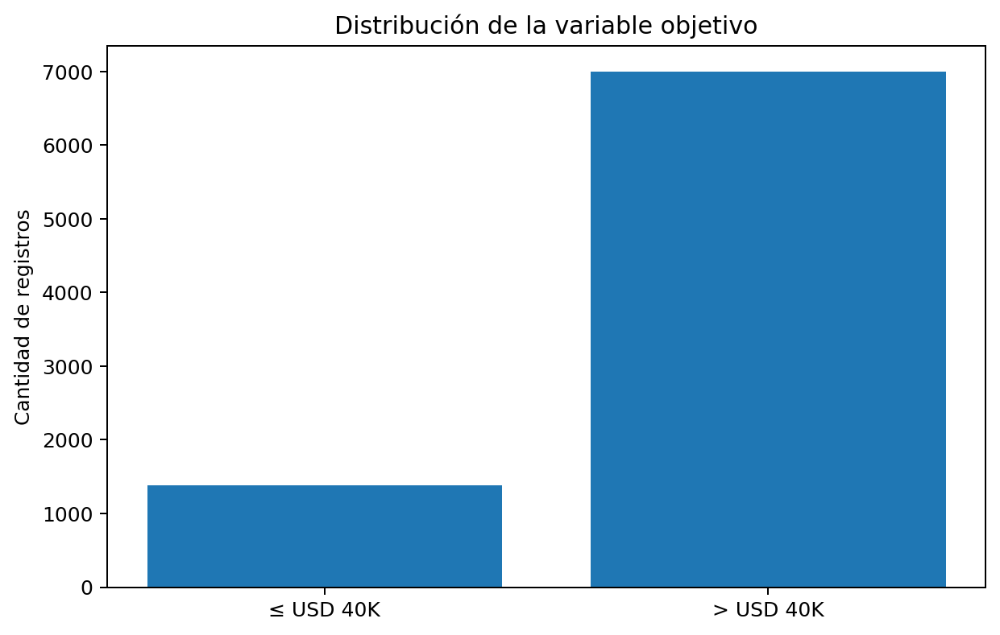

# 00. Resumen ejecutivo

## Propósito del portafolio

Este portafolio presenta un flujo completo de aprendizaje automático aplicado a un problema de predicción salarial, integrando calidad de datos, sesgo, mitigación, evaluación del modelo y explicabilidad XAI.

El objetivo analítico consiste en predecir si una persona supera el umbral de **USD 40.000 anuales**. El objetivo ético consiste en revisar si el modelo podría reproducir diferencias por sexo y si sus decisiones pueden explicarse de forma comprensible para usuarios no técnicos.

## Dataset

El dataset contiene **8,382 registros** y **15 columnas originales**. Incluye variables como departamento, cargo, salario base, horas extra, beneficios, oficina, tipo de contrato y sexo.

La variable objetivo `GanaMas40K` fue creada de la siguiente forma:

```text
IngresoAnual = SalarioTotalConBeneficios * 12
GanaMas40K = 1 si IngresoAnual > 40000; caso contrario 0
```

Distribución de clases:

| Clase | Registros | Porcentaje |
|---|---:|---:|
| ≤ USD 40K | 1,387 | 16.55% |
| > USD 40K | 6,995 | 83.45% |



## Modelo y desempeño

El notebook entrena un **Random Forest Regressor** y convierte su salida continua en una predicción binaria mediante el umbral 0.5.

| Modelo | Accuracy | Precision | Recall | F1 |
|---|---:|---:|---:|---:|
| Baseline clase mayoritaria | 0.8348 | 0.8348 | 1.0000 | 0.9100 |
| Random Forest | 1.0000 | 1.0000 | 1.0000 | 1.0000 |


## Hallazgos XAI

Las técnicas de explicabilidad evidencian que la variable más influyente es `num__SalarioTotalConBeneficios`. Este hallazgo es coherente con la definición de la variable objetivo, pero también revela una dependencia excesiva de una variable directamente relacionada con la etiqueta.

Técnicas aplicadas:

1. **Permutation Feature Importance** para evaluar impacto global de variables.
2. **SHAP** para importancia global y explicación local de predicciones.
3. **LIME** para explicaciones locales de instancias concretas.


## Conclusión ejecutiva

El modelo muestra desempeño perfecto en el conjunto de prueba y métricas de equidad favorables. Sin embargo, desde una perspectiva de calidad de datos y ética algorítmica, se debe advertir que el resultado perfecto está altamente influido por la presencia de `SalarioTotalConBeneficios`, variable desde la cual se construye la etiqueta. El portafolio cumple el propósito académico de mostrar un flujo XAI completo, pero recomienda rediseñar las variables antes de usar un sistema de este tipo en decisiones reales sobre personas.
