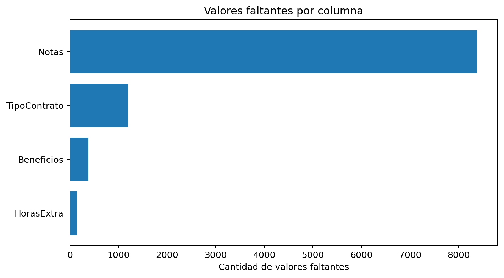
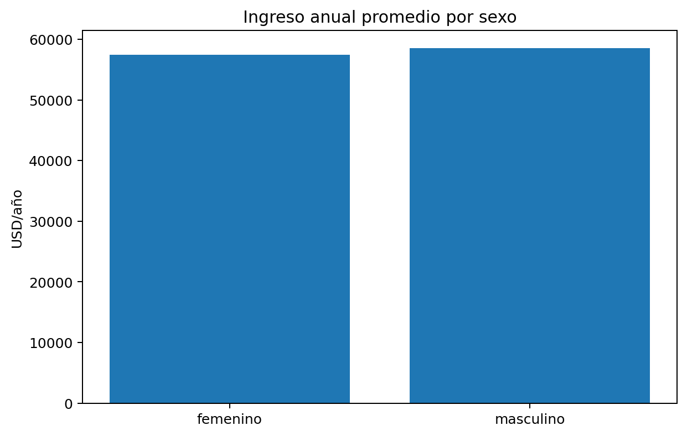
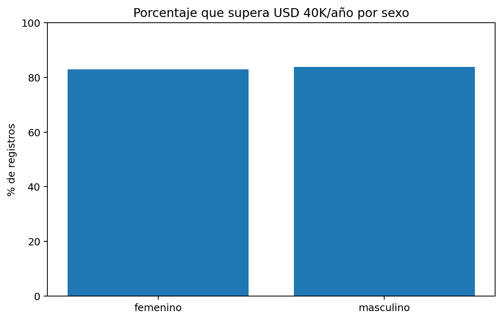

# 01. Metodología y calidad de datos

## Flujo metodológico

El proyecto sigue un flujo de aprendizaje automático supervisado:

1. Carga del dataset salarial.
2. Auditoría de calidad de datos.
3. Creación de variable objetivo binaria.
4. Análisis de sesgo por sexo.
5. Preparación de variables numéricas y categóricas.
6. Entrenamiento de modelo Random Forest.
7. Evaluación de desempeño y equidad.
8. Aplicación de técnicas XAI.
9. Reflexión ética y recomendaciones.

## Auditoría del dataset

Dimensiones del dataset original: **8,382 filas x 15 columnas**.

Valores faltantes relevantes:

| Columna | Valores faltantes | Comentario |
|---|---:|---|
| `HorasExtra` | 150 | Se imputa con mediana en el pipeline numérico. |
| `Beneficios` | 377 | Se imputa con mediana en el pipeline numérico. |
| `TipoContrato` | 1,200 | Se imputa con moda en el pipeline categórico. |
| `Notas` | 8,382 | Columna completamente vacía; se elimina del modelado. |

## Transformaciones aplicadas

Variables eliminadas antes del entrenamiento:

- `ID`: identificador sin valor predictivo generalizable.
- `NombreEmpleado`: dato identificatorio, potencial riesgo de privacidad.
- `Notas`: columna vacía.
- `IngresoAnual`: variable intermedia creada para construir la etiqueta.

Procesamiento de variables:

- Variables numéricas: imputación por mediana y escalamiento estándar.
- Variables categóricas: imputación por valor más frecuente y codificación One-Hot.
- División train/test: 80% entrenamiento y 20% prueba con estratificación por la variable objetivo.
- Mitigación simple: ponderación de registros femeninos con peso 1.2 durante el entrenamiento.

## Análisis inicial de sesgo por sexo

Representación por sexo:

| Sexo | Registros |
|---|---:|
| Femenino | 4,229 |
| Masculino | 4,153 |

Ingreso anual promedio:

| Sexo | Ingreso anual promedio |
|---|---:|
| Femenino | USD 57,506.31 |
| Masculino | USD 58,525.73 |

La diferencia promedio observada es de **USD 1,019.42**, equivalente a aproximadamente **1.77%** por encima del promedio femenino.

Porcentaje que supera USD 40K/año:

| Sexo | % > 40K |
|---|---:|
| Femenino | 83.05% |
| Masculino | 83.87% |

## Riesgos de calidad de datos detectados

1. **Datos faltantes** en `HorasExtra`, `Beneficios` y `TipoContrato`.
2. **Columna vacía** (`Notas`), que debe eliminarse.
3. **Identificadores personales** (`ID`, `NombreEmpleado`), que deben excluirse del modelo.
4. **Posible fuga de información**: `GanaMas40K` se deriva de `SalarioTotalConBeneficios`, que permanece como predictor. Esto explica la importancia dominante de esa variable y el desempeño perfecto.

## Recomendación metodológica

Para fines académicos de XAI, conservar `SalarioTotalConBeneficios` permite observar con claridad cómo las técnicas detectan la variable dominante. Para un modelo productivo, se recomienda entrenar una versión alternativa excluyendo variables directamente derivadas del salario usado para construir la etiqueta.
