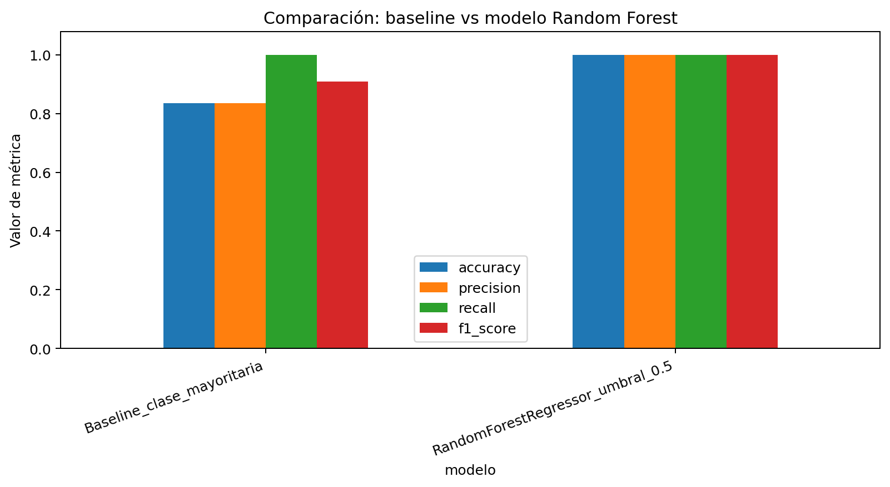
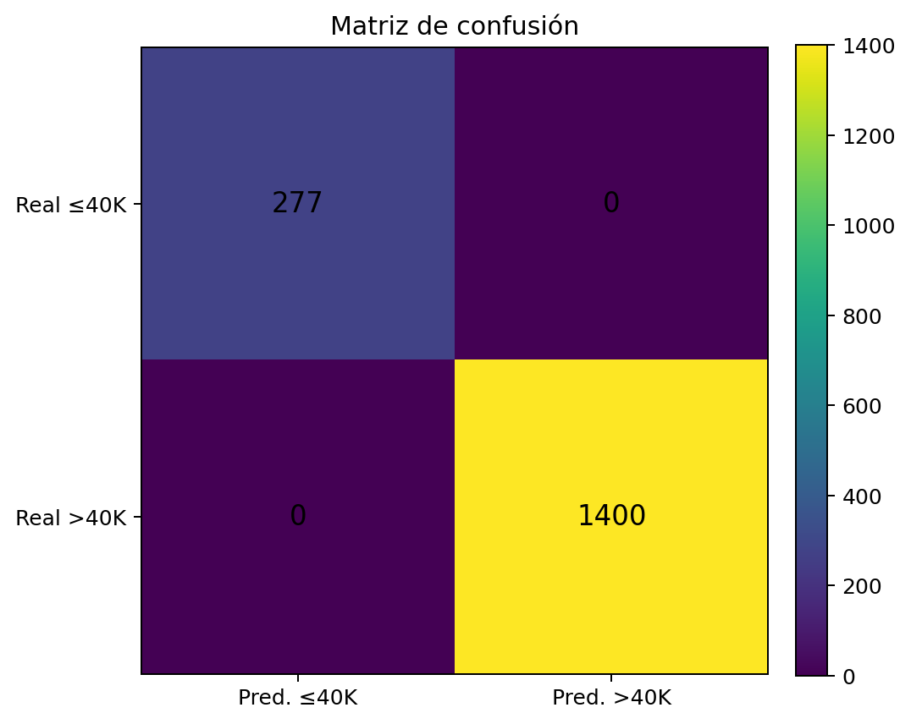
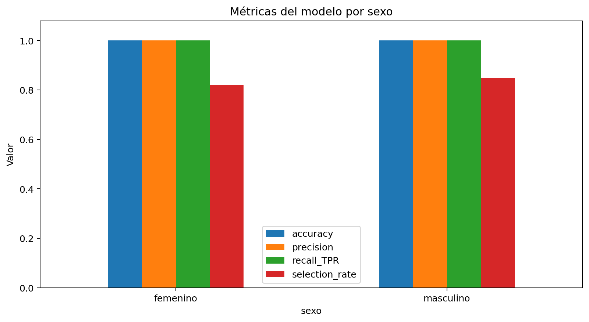

# 02. Entrenamiento del modelo y métricas

## Modelo implementado

El notebook utiliza un **Random Forest Regressor** configurado con:

- `n_estimators = 150`
- `max_depth = 10`
- `random_state = 42`
- `n_jobs = -1`

Aunque el problema es de clasificación binaria, el modelo produce un score continuo. Para convertirlo en clase se aplica:

```text
predicción = 1 si score >= 0.5; caso contrario 0
```

## Justificación técnica

Random Forest es adecuado para este ejercicio porque:

- Maneja relaciones no lineales.
- Tolera datos tabulares con variables numéricas y categóricas codificadas.
- Reduce el riesgo de sobreajuste frente a un árbol individual.
- Se integra con técnicas XAI como SHAP y Permutation Feature Importance.

## Validación train/test

Se realizó división de datos en:

| Conjunto | Registros |
|---|---:|
| Entrenamiento | 6,705 |
| Prueba | 1,677 |

La separación se hizo con estratificación por la variable objetivo para conservar la distribución de clases.

## Métricas de desempeño

| Modelo | Accuracy | Precision | Recall | F1 |
|---|---:|---:|---:|---:|
| Baseline clase mayoritaria | 0.8348 | 0.8348 | 1.0000 | 0.9100 |
| Random Forest | 1.0000 | 1.0000 | 1.0000 | 1.0000 |



## Matriz de confusión

|  | Pred. ≤40K | Pred. >40K |
|---|---:|---:|
| Real ≤40K | 277 | 0 |
| Real >40K | 0 | 1400 |



## Métricas de equidad

| Sexo | n | Accuracy | Precision | Recall/TPR | FPR | Selection rate |
|---|---:|---:|---:|---:|---:|---:|
| femenino | 848 | 1.0000 | 1.0000 | 1.0000 | 0.0000 | 0.8208 |
| masculino | 829 | 1.0000 | 1.0000 | 1.0000 | 0.0000 | 0.8492 |


Métricas globales de equidad:

| Métrica | Valor | Interpretación |
|---|---:|---|
| Diferencia de paridad demográfica | 0.0285 | Baja diferencia entre tasas de selección por sexo. |
| Diferencia de igualdad de oportunidades | 0.0000 | No se observa diferencia en TPR/FPR entre grupos en la prueba. |



## Lectura técnica

El modelo supera claramente al baseline, pero el desempeño perfecto debe analizarse con cautela. Al estar la etiqueta derivada de `SalarioTotalConBeneficios`, y al mantenerse esa variable como predictor, el modelo aprende una relación casi directa con la condición evaluada. Por eso, el resultado es útil como ejercicio de XAI, pero no debe presentarse como evidencia de generalización para escenarios reales sin una versión del modelo sin fuga de información.
