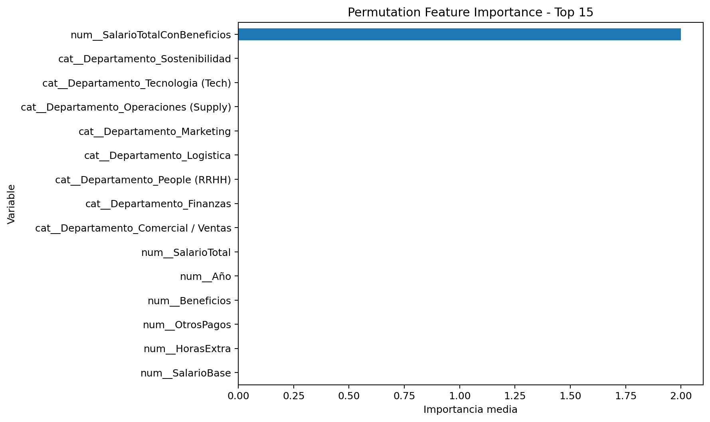
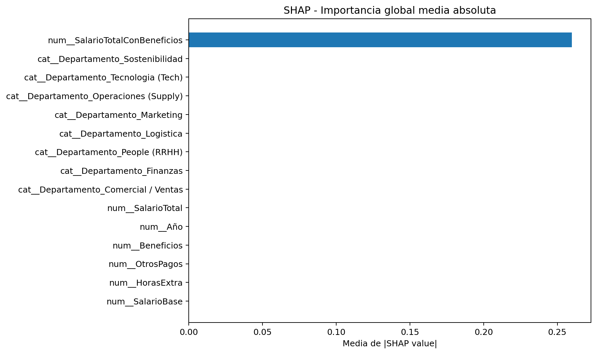
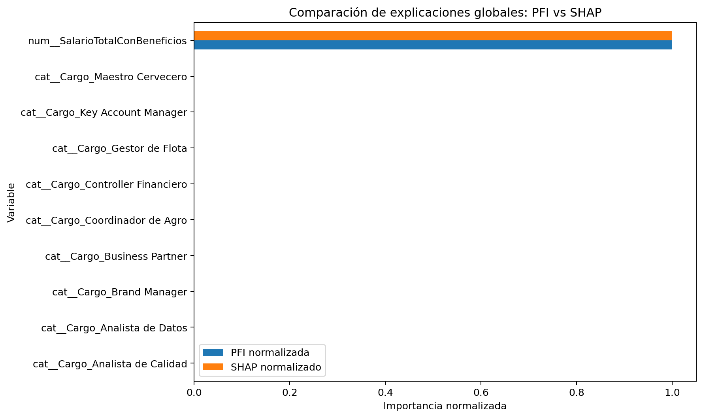
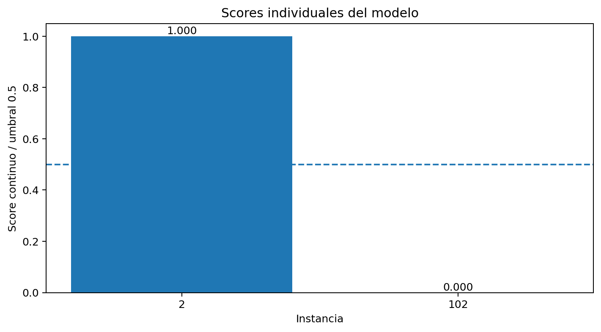
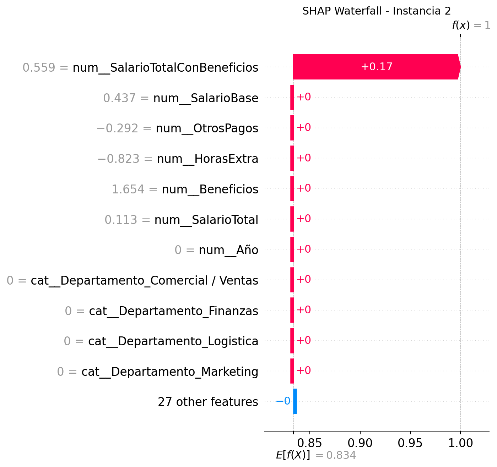
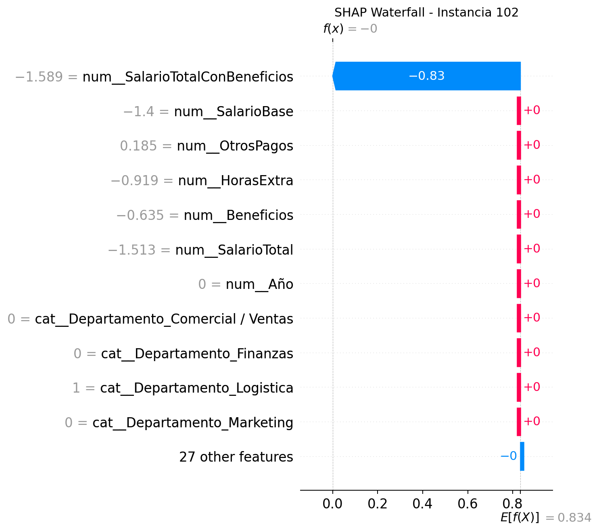
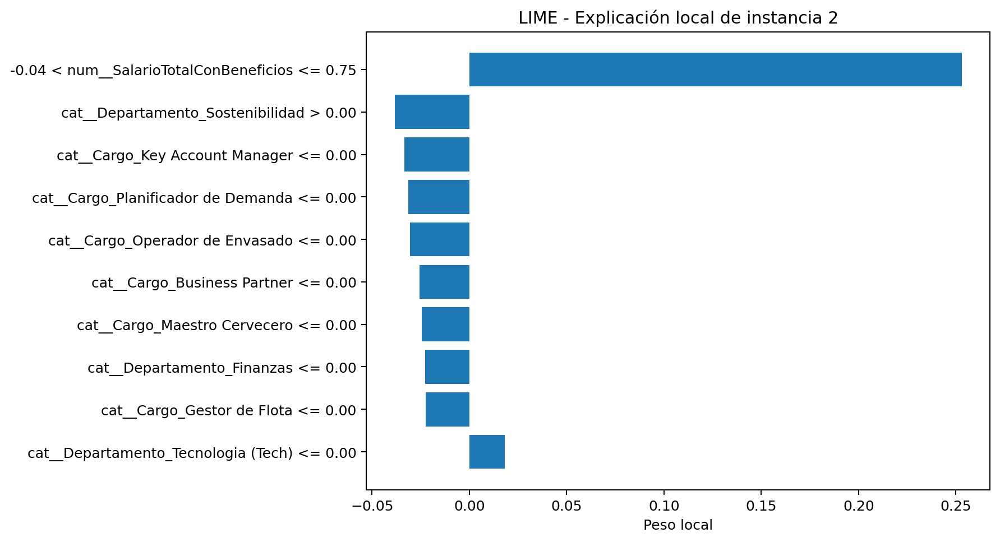
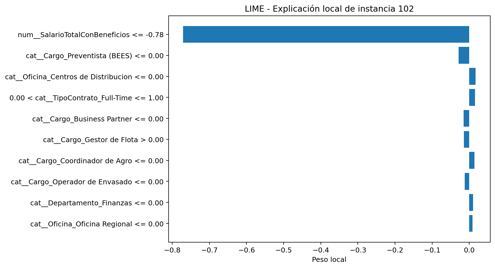

# 03. Explicabilidad XAI

## Técnicas utilizadas

El portafolio aplica tres enfoques de explicabilidad:

1. **Permutation Feature Importance (PFI)**: mide cuánto empeora el rendimiento del modelo cuando una variable se altera aleatoriamente.
2. **SHAP**: estima la contribución de cada variable a la predicción usando valores de Shapley.
3. **LIME**: aproxima localmente el comportamiento del modelo alrededor de una predicción individual.

Estas técnicas cumplen el requerimiento de aplicar al menos dos métodos XAI y permiten comparar explicaciones globales e individuales.

## Permutation Feature Importance

PFI muestra que la variable dominante es `num__SalarioTotalConBeneficios`. Al permutar esta variable, el rendimiento del modelo cae de forma marcada, lo que confirma que el modelo depende principalmente de ella.

Top 10 variables por PFI:

| Variable | Importancia |
|---|---:|
| `num__SalarioTotalConBeneficios` | 2.000276 |
| `num__SalarioBase` | 0.000000 |
| `num__HorasExtra` | 0.000000 |
| `num__OtrosPagos` | 0.000000 |
| `num__Beneficios` | 0.000000 |
| `num__SalarioTotal` | 0.000000 |
| `num__Año` | 0.000000 |
| `cat__Departamento_Comercial / Ventas` | 0.000000 |
| `cat__Departamento_Finanzas` | 0.000000 |
| `cat__Departamento_Logistica` | 0.000000 |

## SHAP

SHAP permite observar tanto la importancia global como la explicación local de predicciones concretas. En el resumen global, la variable `num__SalarioTotalConBeneficios` vuelve a aparecer como el factor principal.

Top 10 variables por SHAP medio absoluto:

| Variable | SHAP medio absoluto |
|---|---:|
| `num__SalarioTotalConBeneficios` | 0.259821 |
| `num__SalarioBase` | 0.000000 |
| `num__HorasExtra` | 0.000000 |
| `num__OtrosPagos` | 0.000000 |
| `num__Beneficios` | 0.000000 |
| `num__SalarioTotal` | 0.000000 |
| `num__Año` | 0.000000 |
| `cat__Departamento_Comercial / Ventas` | 0.000000 |
| `cat__Departamento_Finanzas` | 0.000000 |
| `cat__Departamento_Logistica` | 0.000000 |

## Comparación global PFI vs SHAP

La comparación entre PFI y SHAP confirma consistencia entre técnicas: ambas identifican la misma variable como principal explicación del comportamiento del modelo.

## Explicaciones individuales

Se documentan dos casos concretos:

- **Instancia 2**: predicción positiva (`>40K`).
- **Instancia 102**: predicción negativa (`≤40K`).

### SHAP Waterfall

### LIME

LIME complementa SHAP al construir una explicación local alrededor de cada instancia. En ambos casos, las reglas con mayor peso se relacionan con la variable salarial total y beneficios.

## Interpretación integrada

Las tres técnicas convergen en un mismo hallazgo: el modelo toma decisiones principalmente a partir de `SalarioTotalConBeneficios`. Esta coincidencia mejora la transparencia, porque permite explicar de manera simple por qué el modelo predice una clase u otra.

Sin embargo, también revela una advertencia metodológica: la variable más importante está directamente relacionada con la construcción de la etiqueta. Por tanto, la explicabilidad no solo ayuda a justificar decisiones, sino también a detectar posibles problemas de diseño del dataset y de fuga de información.
